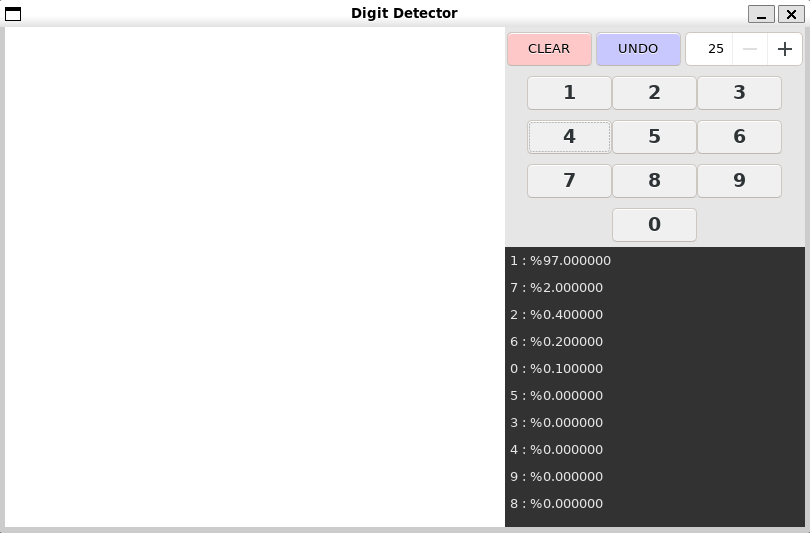
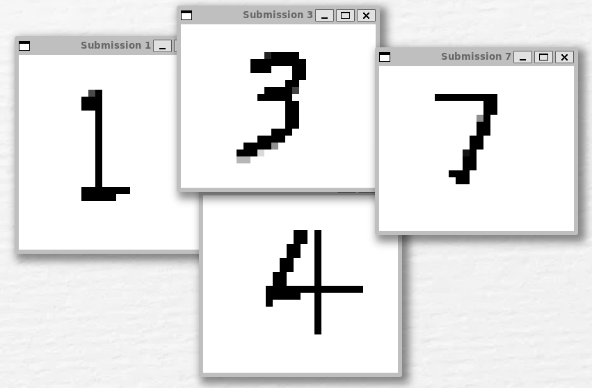

# Digit Detection

A C++ application for recognizing handwritten digits with a neural network using wxWidgets for GUI rendering.

Image of gui (left) and example images of submitted drawing (right) are shown below
<table style="border: none;">
  <tr>
    <td>
      <p align="center"><b>GUI Interface</b></p>
      
    </td>
    <td>
      <p align="center"><b>Submitted Drawings</b></p>
      
    </td>
  </tr>
</table>

The gif below shows a user drawing the number "5" and the neural network ranks which number it closely resembles. The submitted image is later submitted and trained to further improve the AI 
<p align="center">
  
</p>

## Requirements
- Debian-based system (Recommended Ubuntu 24.04 or later)
- CMake 
- C++ Compiler (Recommended C++17)
  
## Install wxWidgets Locally (OPTIONAL)
[wxWidgets Installation Guide](https://github.com/Digit-Detection/digit-detection/blob/main/docs/wxWidgetsInstallation.md)

## Installation Preperation
1. Make sure you've updated your system
```bash
sudo apt update
sudo apt upgrade
```

2. Install dependecies
```bash
sudo apt install cmake # Install CMakeLists
sudo apt install build-essential # Installs Make, G++, GCC
sudo apt install libgtk-3-dev # CMake pkg for GUIs
```

## wxWidgets NOT installed locally
1. Clone the project and all submodules (Note this will take a few minutes)

```bash
git clone https://github.com/Digit-Detection/digit-detection.git --recursive
cd digit-detection
```

2. Build and run the project

```bash
make run
```

## wxWidgets installed locally
Clone the project using

```bash
git clone https://github.com/Digit-Detection/digit-detection.git
cd digit-detection
```

2. Build and run the project
```bash
make dev
```

